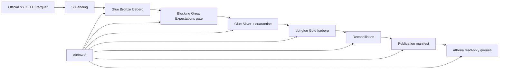

# NYC HVFHV Iceberg Lakehouse


A bounded monthly lakehouse for the official NYC TLC High-Volume For-Hire
Vehicle (HVFHV) trip records. The repository is designed for a Junior Data
Engineer portfolio: one month is the first deployment slice and four
consecutive months are the backfill demonstration.



Iceberg objects in Amazon S3 and metadata in AWS Glue Data Catalog are
canonical. Athena is only the bounded analytical serving layer.

## Status

| Area | Status |
| --- | --- |
| Source, manifest, Bronze/Silver/quarantine, GE, DAG, Gold, publication, and Athena contracts | implemented and locally verified |
| Glue packaging, Terraform format/validation, and credential-independent CI workflow | implemented and statically verified |
| S3, Glue, Iceberg, dbt-glue, Airflow, Athena, IAM, retry, and teardown behavior in AWS | requires AWS execution verification |
| 2025 schema evolution and automated Iceberg maintenance | not implemented |

No AWS deployment has been executed as evidence for this codebase. Do not
describe it as production-ready, deployed, or cloud-verified.

## Monthly lifecycle

```text
immutable S3 URI + SHA-256 + byte size + year/month + run ID
  -> month-scoped Bronze overwrite
  -> structural Great Expectations gate
  -> Silver valid rows + deterministic reason-coded quarantine
  -> month-scoped dbt Iceberg merge into fct_trips
  -> Gold reconciliation
  -> durable publication manifest
  -> partition-filtered Athena smoke query
```

Bronze preserves source rows and adds ingestion metadata. Great Expectations
blocks missing columns or an empty requested month; Silver owns timestamp,
zone, numeric, and duplicate validation. Every Bronze row must reconcile to
exactly one Silver or quarantine row.

Gold is intentionally limited to:

- `dim_date`, `dim_operator`, `dim_zone`
- `fct_trips`
- `mart_hourly_zone_demand`, `mart_operator_metrics`

`fct_trips` uses dbt-glue's Iceberg `merge` strategy with `trip_id` as the
unique key and explicit `source_year`/`source_month` variables. Small
dimensions and marts use simple table rebuilds over the bounded fact history.

## Lightweight local verification

These checks do not require AWS credentials and do not start local Spark or
Airflow:

```powershell
python -m compileall -q athena etl scripts tests
python -m pytest -p no:cacheprovider tests/unit tests/contract -q
python scripts/check_repository_hygiene.py
python scripts/package_glue_jobs.py --output build/nyc_glue_jobs.zip --check
terraform fmt -check -recursive terraform
terraform -chdir=terraform init -backend=false
terraform -chdir=terraform validate
```

CI additionally installs [requirements-ci.txt](requirements-ci.txt), validates
shell syntax, and runs credential-independent `dbt deps`, `dbt parse`, and
`dbt compile --no-introspect` through a closed local Thrift target. Use CI or
a disposable remote development machine for that adapter check; the laptop is
not a Spark runtime.

## Source staging

Production source files are ignored by Git. Check disk space before downloading
the approximately 0.5 GB monthly file:

```powershell
python -m scripts.fetch_source --year 2024 --month 1 --output-dir data
python -m scripts.upload_release_dataset --bucket <bucket> --year 2024 --month 1
```

The downloader also checks the server-provided content length before writing
and preserves a 256 MiB free-space reserve; it removes an incomplete `.part`
file on failure.

The second command is a dry-run plan. During an approved deployment, add
`--execute` to upload the exact local files through the AWS SDK default
credential chain. It records SHA-256 metadata, verifies uploaded byte size,
skips an identical object, and refuses to replace a changed landing object.
Its JSON output contains the Airflow source variables.

Before reading, Bronze performs a read-only S3 metadata check against that
SHA-256 and source byte size; the Taxi Zone object checksum is checked too.

Glue never reads from the laptop or directly from the TLC website. Its
`SOURCE_URI` must be the landed object:

```text
s3://<bucket>/landing/fhvhv_tripdata_2024-01.parquet
```

## Orchestration

The manually triggered Airflow flow is:

```text
prepare_month
  -> bronze_ingestion
  -> great_expectations_checkpoint
  -> silver_transform
  -> dbt_build
  -> reconciliation
  -> publication_manifest
  -> athena_smoke
```

`nyc_hvfhs_four_month_backfill` triggers four monthly DAG runs sequentially
and performs calendar-year rollover correctly. The controlled portfolio run
remains January-April 2024. `force=true` retries only the same URI, checksum,
and byte size; it cannot approve source replacement.

## Deployment and operations

- [Architecture](docs/ARCHITECTURE.md)
- [Implementation status](docs/IMPLEMENTATION_STATUS.md)
- [Deployment code status](docs/DEPLOYMENT_CODE_STATUS.md)
- [One-month deployment runbook](docs/DEPLOYMENT_RUNBOOK.md)
- [Four-month backfill runbook](docs/FOUR_MONTH_BACKFILL_RUNBOOK.md)
- [Teardown runbook](docs/TEARDOWN_RUNBOOK.md)
- [Cloud evidence template](docs/CLOUD_EVIDENCE_TEMPLATE.md)
- [Codebase index](docs/CODEBASE_INDEX.md)
- [Dataset notes](docs/DATASET_NOTES.md)

Terraform protects canonical storage with versioning, SSE-S3, blocked public
access, and `force_destroy = false`. Advanced snapshot expiration, orphan-file
deletion, compaction automation, schema evolution, and full-year processing
remain deferred until the first controlled deployment is verified.

The optional Terraform runner is a private, IMDSv2-only EC2 host; shared VPC,
NAT, endpoints, Docker installation, and SSM connectivity are explicit
operator prerequisites documented in the runbook rather than silently created
by this project.
