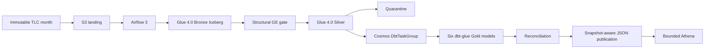

# Architecture

Airflow is the single orchestrator. The first runner remains disposable EC2
with instance-profile authentication. Glue 4.0 runs Bronze, GE, Silver,
reconciliation, and publication. Cosmos owns dbt orchestration only: its
Watcher-mode producer runs the full build and archives `run_results.json`; its
model watchers expose progress. dbt-glue owns only the six Gold relations.

Bronze is source-faithful. GE is structural. Silver is the only row-level
classification owner. Gold is one canonical fact graph. Publication is an
atomic evidence boundary: resolve counts/locations/snapshots, write JSON, then
mark the run published. Athena never becomes canonical.

Exact identity and probable business identity are deliberately separate.
`row_id` changes for any canonical source-field change; `business_trip_key`
stays stable for likely corrections and is not a deduplication key.

The sole advanced path adds nullable `cbd_congestion_fee` for 2025, creates new
data snapshots, queries current data, then version-travels to the retained 2024
snapshot. No general Iceberg maintenance suite is active.
