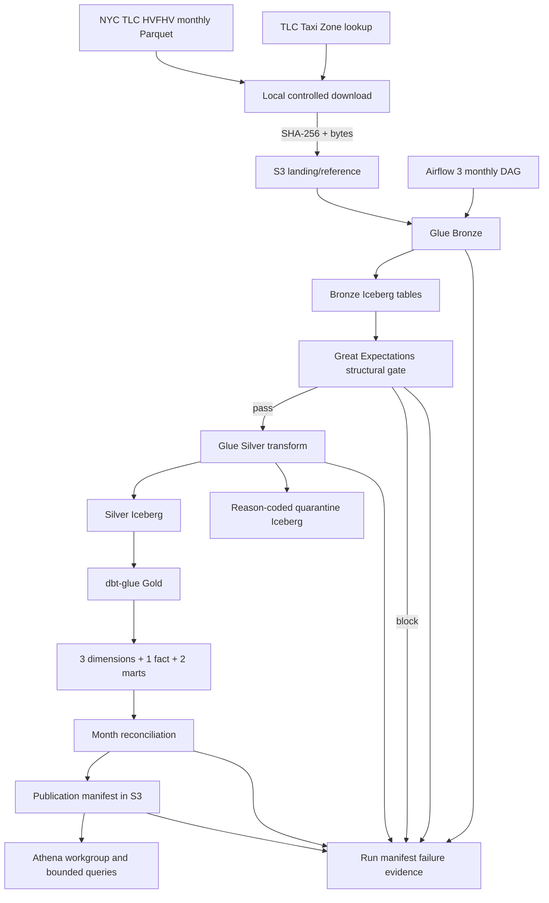

# Architecture

Status: **implemented and statically verified; requires AWS execution verification**.

## Boundaries

- S3 Iceberg data and Glue Catalog metadata are canonical.
- Bronze changes no business values and drops no source rows.
- Great Expectations checks required columns and non-empty monthly input only.
- Silver owns row-level validation, deterministic `trip_id`, deduplication,
  and quarantine.
- dbt owns only the six Gold business models.
- Athena is read-only and limited by one workgroup, Gold IAM scope, encrypted
  results, and a bytes-scanned cutoff.
- Airflow sequences work; it contains no transformation business logic.

## Storage decisions

Bronze, Silver, quarantine, and the run manifest use Iceberg format version 2,
Parquet, and Snappy compression. Monthly trip tables are partitioned by source
year and month. Snappy is explicit because it is broadly supported by Glue and
Athena and keeps the first deployment simple; compression tuning requires
cloud evidence.

The first deployment does not implement schema evolution, branch/tag support,
snapshot expiration, orphan deletion, or compaction automation. Future manual
entry points and safety gates are documented in
[`MAINTENANCE_PREPARATION.md`](MAINTENANCE_PREPARATION.md); they are not part of
the first deployment.
