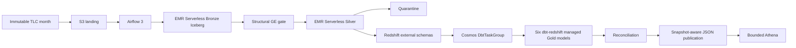

# Architecture

Airflow is the single orchestrator. The first runner remains disposable EC2
with instance-profile authentication. One persistent EMR Serverless application
runs Bronze, GE, Silver, reconciliation, and publication; Glue Data Catalog
remains Iceberg metadata only. Cosmos owns dbt orchestration only: its
Watcher-mode producer runs the full build and archives `run_results.json`; its
model watchers expose progress. Redshift Spectrum exposes the Glue-catalogued
Bronze and Silver Iceberg tables through external schemas, while dbt-redshift
owns only the six Redshift-managed Gold relations.

Bronze is source-faithful. GE is structural. Silver is the only row-level
classification owner. Gold is one canonical fact graph. Publication is an
atomic evidence boundary: resolve counts/locations/snapshots, write JSON, then
mark the run published. Athena never becomes canonical.

## Migration boundary

This phase changes only the Gold transformation backend and its Cosmos runtime.
The DAG dependency chain and downstream tasks are intentionally unchanged.
The existing reconciliation, publication, and Athena implementations still
expect Glue-catalogued Gold Iceberg tables, so their execution against
Redshift-managed Gold is **NOT VERIFIED** and requires a separately scoped
adapter migration before the complete deployed pipeline can succeed.

Exact identity and probable business identity are deliberately separate.
`row_id` changes for any canonical source-field change; `business_trip_key`
stays stable for likely corrections and is not a deduplication key.

The sole advanced path adds nullable `cbd_congestion_fee` for 2025, creates new
data snapshots, queries current data, then version-travels to the retained 2024
snapshot. No general Iceberg maintenance suite is active.
